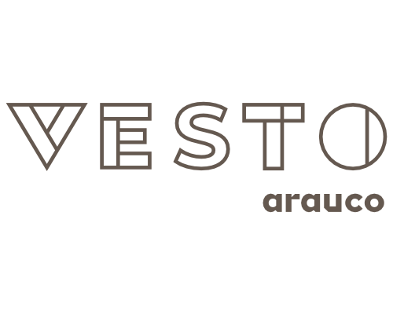
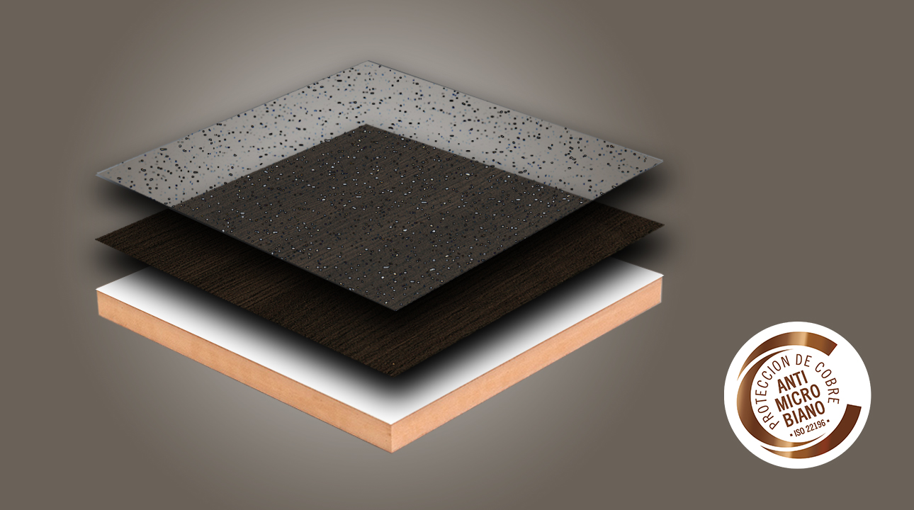

# Cama Emergencia Vesto

## Descripción

Este proyecto está dentro de la categoría de unidades de aislamiento. Se propone la producción de una cama con propiedades antimicrobiales que de solución a las necesidades de recursos para alojar pacientes en situaciones de emergencia a través de un diseño de rápida producción.

  

Melamina VESTO, protección con el desarrollo de una exclusiva aplicación creada en base a tecnología InCopper, con efectivas propiedades antimicrobianas, capaz de eliminar el 99% de virus, bacterias, hongos y moho de su superficie en las primeras 2 horas de contacto a temperatura ambiente. Inactiva microbios en forma rápida y continua. Mantiene su efectividad después de múltiples procesos de limpieza. Seguro para las personas y amigable con el medio ambiente.

  

VESTO es un tablero de partículas de densidad media (MDP) recubierto con un papel impregnado con resina melamínica la cual contiene micropartículas de  cobre, las que entregan la propiedad antimicrobiana a la superficie.

El cobre, al ser aplicado durante el proceso de impregnación del papel antes de que este sea prensado al tablero, permite que la protección se mantenga en el tiempo a lo largo de toda la vida útil del producto, aún después de múltiples procesos de limpieza.

Pruebas certificadas y realizadas bajo la norma ISO 22196 han demostrado que la protección de Cobre Antimicrobiano de VESTO inactiva el 99% las  bacterias en las primeras 2 horas de contacto con la superficie a temperatura ambiente.

Esta iniciativa se encuentra en la plataforma:
[Kits Hospitalarios (D1229)](https://arauco.brightidea.com/D1229)

## Archivos descargables

3D Formato STEP 
[cama-emergencia-vesto.stp](https://github.com/josemagr95/covid-innovarauco/raw/master/cama-emergencia-vesto/cad/step/cama-emergencia-vesto.stp)

3D Formato 3DM (Rhinoceros) 
[cama-emergencia-vesto.3dm](https://github.com/josemagr95/covid-innovarauco/raw/master/cama-emergencia-vesto/cad/3dm/cama-emergencia-vesto.3dm)

3D Formato DXF (Archivo de corte) 
[cama-emergencia-vesto.dxf](https://github.com/josemagr95/covid-innovarauco/raw/master/cama-emergencia-vesto/cad/dxf/cama-emergencia-vesto.dxf)

Ficha técnica (Archivo PDF) 
[cama-emergencia-vesto.pdf](https://github.com/josemagr95/covid-innovarauco/raw/master/cama-emergencia-vesto/docs/cama-emergencia-vesto.pdf)  

***

Licencia: [![CC BY 4.0][cc-by-shield]][cc-by]

This work is licensed under a [Creative Commons Attribution 4.0 International
License][cc-by].

[![CC BY 4.0][cc-by-image]][cc-by]

[cc-by]: http://creativecommons.org/licenses/by/4.0/
[cc-by-image]: https://i.creativecommons.org/l/by/4.0/88x31.png
[cc-by-shield]: https://img.shields.io/badge/License-CC%20BY%204.0-lightgrey.svg